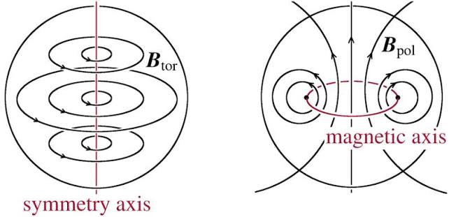

MagnetoHydrodynamics (MHD)
============================

1- What MF configuration is used in the simulation, and how they dynamically evolved? (e.g. dipole, quadrupole, etc.)

Field geometry(poloidal/toroidal) describe the direction of the field lines, and the field strength is the magnitude of the magnetic field at a given point in space. The field geometry describe the direction of MF with respect to the star's symmetry axis.

Note: 1- Axisymmetric is just a symmetry assumption about the white dwarf(usually as the z-axis so del/del phi = 0).

B in spherical coordinates is given by:

.. math::

   \boxed{
   \mathbf{B}
   =
   B_r \hat{\mathbf{r}}
   +
   B_\theta \hat{\boldsymbol{\theta}}
   +
   B_\phi \hat{\boldsymbol{\phi}}
   }

and then seperate it into poloidal-toroidal components as:

.. math::

   \mathbf{B}
   =
   \mathbf{B}_{\mathrm{pol}}
   +
   \mathbf{B}_{\mathrm{tor}}

where

.. math::

   \mathbf{B}_{\mathrm{pol}}
   =
   B_r \hat{\mathbf{r}}
   +
   B_\theta \hat{\boldsymbol{\theta}}

and

.. math::

   \mathbf{B}_{\mathrm{tor}}
   =
   B_\phi \hat{\boldsymbol{\phi}}

Note : 2 -Decomposition is important as each field have very different str, lorentze force, stellar deformatiom and stability properties.

Pure poloidal field - 

.. math::

   \boxed{\mathbf{B}_\phi = 0}

These fields lines travel through the stellar interior(x-z and y-z planes).
Note : 3- the field external to the star is primarily poloidal.

Conceptually, a dipolar magnetic field is similar to the magnetic field of a
large bar magnet with north and south magnetic poles. Outside the star, the
magnetic-field lines emerge from the north magnetic pole and enter the south
magnetic pole. Inside the star, they continue from the south pole back toward
the north pole, forming closed magnetic-field loops.

The complete field-line path can therefore be visualized schematically as

.. math::

   \boxed{
   N_{\rm outside}
   \;\rightarrow\;
   S
   \;\rightarrow\;
   S_{\rm inside}
   \;\rightarrow\;
   N
   }

The closed nature of magnetic-field lines is associated with the
divergence-free condition

.. math::

   \boxed{\boldsymbol{\nabla}\cdot\mathbf{B}=0}

which expresses the absence of magnetic monopoles.

**Magnetic moment:** A magnetic moment is a vector quantity that characterizes
the strength and orientation of a magnetic source. Its direction determines
the orientation of the associated magnetic field and how the magnetic source
tends to align in an external magnetic field.

Why Dipole?
-----------

The term *dipole* refers to a magnetic configuration havimg two opposite polar regions.

For an ideal magnetic dipole, magnetic moment along z,

.. math::

   \boxed{\mathbf{m} = m \hat{\mathbf{z}}}